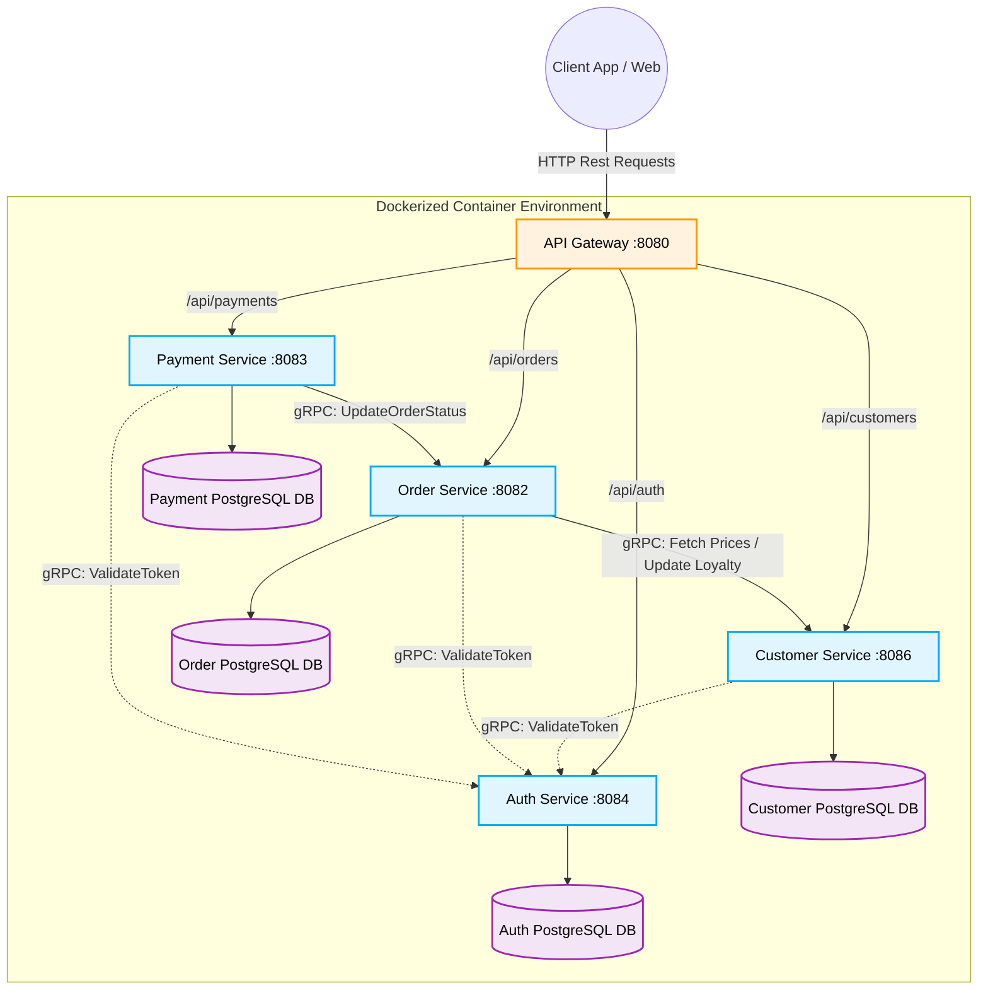

# Project Report: Laundry Microservices Platform

## 1. Project Introduction

**Overview**
The Laundry Microservices Platform is an enterprise-grade, cloud-native application designed to digitize and streamline the entire lifecycle of laundry service operations. Developed as part of the CTSE assignment, it demonstrates modern distributed system patterns, high availability, and loose coupling. 

The platform provides a seamless end-to-end user experience: customers can securely register and log in, manage their profiles and access loyalty rewards, browse real-time service catalogs (e.g., Wash, Iron), place detailed laundry orders, track their order status from creation to completion, and safely process payments. By decomposing these core business capabilities into independent, highly specialized microservices, the system achieves exceptional scalability, fault isolation, and maintainability.

**Technology Stack**
The project relies on a robust and modern technology stack:
* **Core Framework:** Java 21, Spring Boot 3.2.3, and Spring Cloud 2023.
* **Security:** Spring Security paired with JJWT 0.12 for stateless JSON Web Token (JWT) authentication.
* **Inter-Service Communication:** gRPC 1.62 and Protobuf 3.25 for high-speed, strictly typed internal communication, combined with standard HTTP/REST for external API clients.
* **Persistence:** PostgreSQL 16 with Spring Data JPA, enforcing a strict "database-per-service" architectural pattern.
* **DevOps:** Docker and Docker Compose for containerization and orchestration, alongside a Maven multi-module dependency structure.

**System Modules**
The system is divided into functional domains:
1. `auth-service` (Port 8084): Manages user registration, login, and JWT issuance.
2. `customer-service` (Port 8086): Manages customer profiles, loyalty programs, and pricing entries.
3. `order-service` (Port 8082): Manages the full lifecycle of laundry orders.
4. `payment-service` (Port 8083): Processes checkout and payment transactions.
5. `gateway` (Port 8080): Spring Cloud Gateway acting as the single front-door entry point.
6. `common` & `grpc-lib`: Shared libraries for universal API responses, exception handling, and auto-generated protobuf stubs.

---

## 2. Shared Architecture Diagram

The system follows a microservices architecture with a centralized API Gateway handling all external traffic. Services communicate internally via gRPC to eliminate HTTP overhead for backend transactions.

---

## 3. Description and Rationale of Microservices

**1. `auth-service`**
* **Description:** Acts as the secure gatekeeper of the platform, managing user registration, secure password hashing, login authentication, and the issuance of stateless JSON Web Tokens (JWTs). Additionally, it hosts a high-speed internal gRPC endpoint that actively allows other microservices to validate these tokens on the fly.
* **Rationale:** Dedicating a specific service to authentication completely decouples security protocols from core business logic. Centralizing identity management in this way allows the rest of the ecosystem to remain entirely stateless. It also significantly reduces database read-write overhead, as other services can strictly rely on this single source of truth to handle all cryptographic payload verifications.

**2. `customer-service`**
* **Description:** Operates as the central repository for all user-centric metadata. It manages detailed customer profiles, maintains the global laundry pricing schemas based on service types (e.g., Wash, Iron, Dry Clean), and handles the entire lifecycle of the platform’s loyalty and rewards program (calculating, applying, and refunding loyalty points).
* **Rationale:** In a robust microservices architecture, maintaining strict separation of concerns is vital. Extracting customer and pricing logic securely decouples volatile user data from strict transactional processes. Because profile lookups and pricing calculations generally endure a much higher read traffic volume than order placements, isolating this service enables independent scaling to fluidly handle read-heavy traffic spikes.

**3. `order-service`**
* **Description:** Serves as the platform's core transactional orchestration engine. It actively manages the complete lifecycle of laundry orders—from taking initial basket configurations to tracking complex state transitions such as `CREATED`, `PROCESSING`, `PAID`, and `COMPLETED`. It communicates directly with the customer service for dynamic pricing and relies on the payment service to confirm checkout successes.
* **Rationale:** By strictly isolating the order domain, the system securely manages highly complex workflows and database state machines without being weighed down by peripheral tasks like user profile management or external payment gateway integrations. If the platform experiences a massive weekend rush of laundry requests, the order pipeline can seamlessly scale horizontally without unnecessarily duplicating other system components.

**4. `payment-service`**
* **Description:** An isolated, highly secure microservice exclusively responsible for processing user checkouts and payment transactions. It generates secure checkout sessions, interacts with external payment gateways (e.g., Stripe), and safely maintains an immutable internal accounting ledger of all financial operations tied to specific order IDs.
* **Rationale:** Financial transactions require the highest degree of fault tolerance and isolation. This strict compartmentalization drastically minimizes the scope of external security audits and substantially improves compliance capabilities. Furthermore, if the upstream payment provider experiences significant latency or complete failure, this isolation ensures the failure doesn't continuously cascade—allowing users to still browse catalogs and track existing orders uninterrupted.

**5. `gateway` (API Gateway)**
* **Description:** Built on Spring Cloud Gateway, this component acts as the singular front-door edge proxy for the entire platform. It intercepts all incoming external HTTPREST requests, applies cross-origin resource sharing (CORS) rules, and transparently routes the traffic to the appropriate backend microservices while preserving essential payload headers.
* **Rationale:** Exposing individual microservice IP addresses and ports to the public internet presents a massive security vulnerability. The gateway completely hides the internal distributed architecture from the client application, presenting a unified, simplistic API surface. It centralized cross-cutting networking concerns like path-rewriting and pre-flight CORS resolution, eliminating the need to identically replicate these configurations across every backend node.

---

## 4. Communication with Other Services

The platform utilizes both HTTP (for external API consumption via Gateway) and gRPC (for high-speed internal communication), mapping dependencies across all microservices.

* **Gateway Routing (HTTP Proxy):**
  The `gateway` receives all external REST API calls and routes them to the appropriate backend service (`/api/auth/*` to `auth-service`, `/api/orders/*` to `order-service`, etc.), transparently passing JWT headers.

* **Inter-Service to Auth (Token Validation - gRPC):**
  When a service (like `customer-service` or `order-service`) receives a profile update or order creation via HTTP, it extracts the JWT header and makes a synchronous gRPC call (`ValidateTokenRequest`) to the `auth-service`. This ensures the requester is authenticated without adding the overhead of an HTTP round-trip on internal networks.
  
* **Order to Customer (Pricing & Loyalty - gRPC):**
  The `order-service` heavily relies on `customer-service` as an authoritative source for calculating order totals. When a user creates an order, `order-service` executes a `GetPrice` gRPC call. The `customer-service` evaluates the item type, applies applicable loyalty discounts, and returns the strictly-typed response.
  
* **Payment to Order (State Updates - gRPC):**
  Another prime example of inter-service communication is the `payment-service` executing an `UpdateOrderStatus` gRPC call to the `order-service` immediately after a successful financial checkout transaction. This actively communicates payment finality, keeping the order lifecycle consistent.

---

## 5. DevOps and Security Practices

**DevOps Practices Across Services:**
* **`docker-compose.yml` (Unified Orchestration):** A single deployment file coordinates the `auth-service`, `customer-service`, `order-service`, `payment-service`, and `gateway`, establishing the internal Docker network.
* **Automated Data Provisioning (Multi-DB):** A highly effective `init.sql` script creates strictly isolated context boundaries (`authdb`, `customer_db`, `orderdb`, `paymentdb`) for each service automatically, ensuring true loose coupling on startup.
* **Shared Libraries (`common`, `grpc-lib`):** Rather than repetitive configurations, all services rely on a Maven multi-module structure. A single build phase triggers `protoc` binaries universally, guaranteeing that `order-service` and `customer-service` communicate using cleanly synched proto stubs.

**Security Practices Across Services:**
* **`gateway` (Edge Perimeter Security):** The Spring Cloud Gateway is the sole entry point holding public exposure. Internal services (`auth`, `customer`, `order`, `payment`) block direct public port routing entirely.
* **Zero-Trust Inner Network:** Every backend service actively distrusts incoming traffic. Whether a call routes to `payment-service` or `customer-service`, the microservice first confirms authorization by making a rapid gRPC ping back to `auth-service`.
* **Standardized Exception Masking (`common`):** A `@ControllerAdvice` `GlobalExceptionHandler` ensures that if a database query fails within `order-service` or `customer-service`, no sensitive Java stack-trace is leaked. All services seamlessly wrap failures inside a universally defined `ApiResponse<T>`.

---

## 6. Challenges Faced and Addressed

**Service-Specific Challenges:**
* **`auth-service` (Stateless Validation):** Enabling rapid, high-volume token validation across all microservices without bottlenecking the database. *Solution:* Used stateless `JJWT` tokens where `auth-service` strictly validates incoming gRPC tokens by aggressively verifying their cryptographic payload directly on the CPU, skipping costly DB lookups.
* **`customer-service` (Loyalty State Compensation):** Tracking loyalty points during edge-cases, such as a user applying points but a payment subsequently failing, proved challenging. *Solution:* Addressed this by conceptualizing a compensatory logic pattern: if `payment-service` fails a charge, the `order-service` sends a gRPC "rollback" request to `customer-service` to safely restore the deducted loyalty points.
* **`order-service` (Distributed Transactions):** Preserving eventual consistency across microservice states without engaging heavy two-phase commits. *Solution:* Implemented event-driven remote procedures. The `order-service` patiently shifts orders to 'PAID' strictly upon an explicit `UpdateOrderStatus` gRPC confirmation sent forcefully by the `payment-service`.
* **`payment-service` (Idempotent Charging):** Mitigating the risk of double-charging users during unstable network retries. *Solution:* Implemented transactional validations per associated `orderId`, preventing a checkout script from being executed twice and guaranteeing idempotency.
* **`gateway` (CORS and Pre-Flights):** Frontend `OPTIONS` preflight requests were continuously blocked when bouncing off the Spring WebFlux proxy to backend Tomcat servers. *Solution:* Fully isolated and strictly assigned complete CORS evaluation exclusively directly to the gateway's centralized routing definitions.

**Integration Challenges:**
* **gRPC Dynamic Port Mapping in Docker:** Initially, the microservices struggled to discover each other's gRPC stubs dynamically because containers assigned unpredictable IP addresses. *Solution:* We strictly defined internal network aliases within `docker-compose.yml` and configured the application properties to evaluate hostnames using robust environment variables (e.g., `grpc.client.auth-service.address=static://${AUTH_SERVICE_GRPC_HOST}:${AUTH_SERVICE_GRPC_PORT}`).
* **Shared Proto Synchronization:** Managing `.proto` file changes across multiple group members caused severely mismatched stub definitions between `order-service`, `payment-service`, and `customer-service`. *Solution:* Centralizing all protobuf syntax into a strict, version-controlled `grpc-lib` Maven module. Whenever a definition updated, the entire shared library was forcefully rebuilt across the platform, immediately ensuring completely synchronized client and server stubs.
